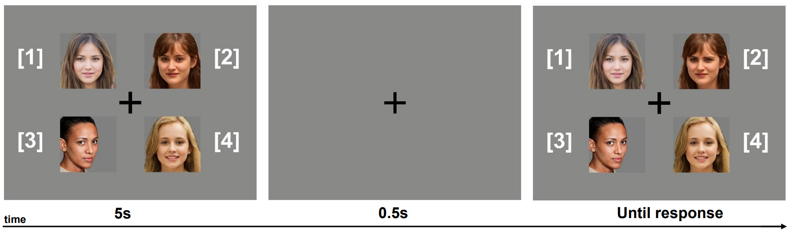

# Semester Project

In this repo I present my work for my bachelor semester project at EPFL in IVRL Lab.


## Requirements

* Linux and Windows are supported, but Linux is recommend for performance and compatibility reasons.
* 1&ndash;8 high-end NVIDIA GPUs with at least 12 GB of memory.
* 64-bit Python 3.8 and PyTorch 1.9.0 (or later). See https://pytorch.org for PyTorch install instructions.
* CUDA toolkit 11.1 or later.
* GCC 7 or later (Linux) or Visual Studio (Windows) compilers. Recommended GCC version depends on CUDA version, see for
  example [CUDA 11.4 system requirements](https://docs.nvidia.com/cuda/archive/11.4.1/cuda-installation-guide-linux/index.html#system-requirements).
* Python libraries: see [environment.yml](./environment.yml) for exact library dependencies. 


## Getting started

Follow the guides in the *pretrained/* directory to download the models that you want. You can also use your own GAN models.

### Apps

In the *apps/* directory you can found three directories *GANSpace/*, *StyleSpace/* and *Face_Attribute_CP_Experiment/*. Those directories refers to different subject I worked on during my project.


## GANSpace

I implemented a reproduction of [GANSpace](https://arxiv.org/pdf/2004.02546.pdf), an unsupervised GAN-based image editing algorithm
which use PCA to discover meaningful latent space directions, and then manually attribute a semantic meaning to each of the found directions.

In *GANSpace/* directory, two streamlit apps can be found. Using those apps, you can choose a GAN model and a dataset to generate an image and
apply GANspace image edit to it.

* Using `ganspace.py` you can visualize GANSpace edits of an image for different components, layers and intensity $\alpha$.
* Using `ganspace_sequential_editing.py` you can stack sequences of GANSpace edits to an image.


## StyleSpace

I implemented a reproduction of [StyleSpace](https://arxiv.org/pdf/2011.12799.pdf), a GAN-based image editing algorithm which
manipulates the style channels of StyleGAN2 to perform localized edits.  

In *StyleSpace/* directory, a streamlit app `stylespace.py` can be found. Using it, you can choose a StyleGAN2 dataset, a batch size and a seed to generate images.
Now, in the source code of that file two methods can be run:

* `apply_stylespace_to_batch(layer=, channel=, alpha=)` which applies a StyleSpace edit to every image of the batch 
    and show all the images before and after the edit.
* `apply_stylespace_alphas(number_of_images=, layer=, channel=, alpha_min_max=)` which applies a StyleSpace edit at different intensity $\alpha$ to the first image of the batch.
    
Using these two methods you can see their respective StyleSpace edits in the streamlit app.

    
## Utilizing GANs to Study Human Face Perception


Abstract: *A manipulation of the latent code of an image produced by a Generative Adversarial network (GAN) can bring localized or
general aspect changes to the initial image. Here, we are focusing on GAN-generated photo-realistic face images.
Through a psycho-visual experiment, we perform a study to determine, in relation to latent space properties, to what extent humans
can perceive localized image edits in face attributes such as the hairstyle, the hair color, the nose, the mouth, the eyes and the eyebrows. 
This study can bring a new metric for future perceptual or cognitive science experiments and a powerful knowledge on how, based on social
or natural aspects, we, as human beings, perceive change of specific facial attributes.*

You can found in directory *Face_Attribute_CP_Experiment/* the code to create perception experiments of face attribute edits.
In order to make localized face attribute edits, we use [LELSD](https://arxiv.org/pdf/2111.12583.pdf) GAN-based image editing algorithm.

### Before Starting

In the *pretrained/stylegan2/* directory, download `ffhq.pkl`, the pretrained StyleGAN2 model trained on FFHQ at 1024x1024
([Download link](https://nvlabs-fi-cdn.nvidia.com/stylegan2-ada-pytorch/pretrained/ffhq.pkl)) coming directly from the [official StyleGAN2-ADA repo](https://github.com/NVlabs/stylegan2-ada-pytorch).

In the *pretrained/face_bisenet/* directory, follow the instruction and download the model and rename it as `model.pth`.

In the *notebooks/* directory, open the notebook `train_lelsd_stylegan2.ipynb` and train the LELSD model for StyleGAN2-FFHQ.
It should create a directory *out/* and in it you should found a directory *lelsd_stylegan2_ffhq/*.
It can take some time to run but in the end you must have access to *out/lelsd_stylegan2_ffhq/W+_L2_average/1D/face_bisenet/* 
and find there face attribute semantics directories.

### Steps to create the experiments and run the behavioral study

#### 1. Generates Random faces

In *Face_Attribute_CP_Experiment/data_creation/* open the source code of the streamlit app `random_faces_dataset_generator.py`
and enters the value you want for the variable `NUMBER_OF_BATCH`:

```
########  INPUT ########
NUMBER_OF_BATCH = 5
########################
```
A batch consists of four images so the total number of images
generated will be equal to `NUMBER_OF_BATCH` $\times$ 4.

Then run the streamlit app. This should generate (in the same directory level) a directory *out/* containing the file `random_faces.pkl`.

#### 2. Images Selection

Since it's possible that some images are not well sythesized, contains artifacts... you should manually proceed to a selection of images generated in step 1.

In *Face_Attribute_CP_Experiment/data_creation/* run the Tkinter app `images_selection.py`. This opens a GUI in which you can manually select the images you want. Press **Select Image** if you want to select the image
shown or press **Next** if you want to see the next image. Quit the app whenever you want in order to finish the selection.

After this, you should have a file `selected_images.pkl` in *out/* directory.

Now run the file `pickle_to_shelve.py`. This should print in the terminal:

```
NUMBER_OF_SELECTED_IMAGES =  <x>
IMPORTANT: This number must be inserted in the field NUMBER_OF_SELECTED_IMAGES_IN_SOURCE of experiments_generator.py 
```

The value of `NUMBER_OF_SELECTED_IMAGES` must be inserted in the field `NUMBER_OF_SELECTED_IMAGES_IN_SOURCE` of the source code of `experiments_generator.py`

#### (2.1 Optional) Check Selected Images

You have the possibility to look at the images you selected in step 2.

In *Face_Attribute_CP_Experiment/data_creation/utils/* run the Tkinter app `show_selected_images.py`.


#### 3. Generate Experiments

In *Face_Attribute_CP_Experiment/data_creation/* open the source code of the streamlit app `experiments_generator.py`. There, you have the possiblity to input the number of experiments you want to generate and the number of tests per experiments:

```
NUMBER_OF_EXPERIMENTS = 10
NUMBER_OF_TESTS_PER_EXPERIMENT = 3
```

Now run the stramlit app.

After the run, you should found a newly created directory *Face_Attribute_CP_Experiment/experiments_data/* which contains all the experiments
data. The name of the directories inside it are the experiment numbers and in each of these directories you can find:
* a csv containing information about the image edits in each test of the experiment and other metadatas
* a pkl file containing the images of that experiments and the latent code of the edited image before and after the edit take place.


#### 4. Run the Behavioral Study App

In *Face_Attribute_CP_Experiment/* directory, open the source code of `behavioral_study_app.py` and make sure that the variables:
`NUMBER_OF_EXPERIMENTS_CREATED` and `NUMBER_OF_TESTS_PER_EXPERIMENT` have the same value than the input of step 3.

```
NUMBER_OF_EXPERIMENTS_CREATED = 10
NUMBER_OF_TESTS_PER_EXPERIMENT = 3
```

Plus, you have the possibility to change some experiments behavior:
```
# App Behavior:
SECONDS_AFTER_INITIAL_IMAGE = 5
SECONDS_AFTER_MIDDLE_IMAGE = 0.5
SECONDS_BETWEEN_TESTS = 3
```

Finally, you can now run the stramlit app `behavioral_study_app.py` and do an experiment.
After finishing an experiment, the results will be store in a newly created directory *Face_Attribute_CP_Experiment/behavioral_study_results/*.

#### Utils: Look at a test item of a generated experiment

You can see the images generated for a test item of a specific experiment.

In the directory *Face_Attribute_CP_Experiment/utils/*, open the source codr of
the streamlit app `show_test_in_exp.py`. Now change as you want the variables:

```
EXPERIMENT_NUMBER = 0
TEST_NUMBER = 2
```
Then run the streamlit app to see the images of that specific test.

### Analyse the Behavioral Study Results:

After some participants did the behavioral study, you may want to analyse the results.

In *Face_Attribute_CP_Experiment/utils/* run the streamlit app `analyse_behavioral_study_results.py` to see some statistics.


## Acknowledgement

I used the repository of [LELSD](https://github.com/IVRL/LELSD) as a base to my works.

**LELSD**
```
https://github.com/IVRL/LELSD
```

**StyleGAN2-ADA — Official PyTorch implementation**

```
https://github.com/NVlabs/stylegan2-ada-pytorch
```

**Alias-Free Generative Adversarial Networks (StyleGAN3)**

```
https://github.com/NVlabs/stylegan3
```

**DeepLab with PyTorch**

```
https://github.com/kazuto1011/deeplab-pytorch
```

**face-parsing.PyTorch**

```
https://github.com/zllrunning/face-parsing.PyTorch
```

**Linear Semantics in Generative Adversarial Networks**

```
https://github.com/AtlantixJJ/LinearGAN
```

**PyTorch pretrained BigGAN**

```
https://github.com/huggingface/pytorch-pretrained-BigGAN
```

**Localized Semantic Editing of StyleGAN outputs**

```
https://github.com/IVRL/GANLocalEditing
```


